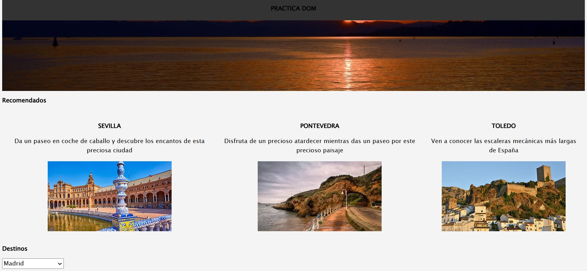

# ✈️ Práctica DOM: Viajes
Una **práctica interactiva con JavaScript, HTML y CSS** enfocada en manipular el DOM para mostrar y filtrar información sobre destinos de viaje. Ideal para poner en práctica conceptos como **event listeners**, **creación dinámica de elementos** y **estilos responsivos**.

## 🛠️ Tecnologías utilizadas
- 🖋️ **HTML5** – Estructura semántica del contenido  
- 🎨 **CSS3** – Estilos y diseño responsive  
- ⚡ **JavaScript (Vanilla)** – Interactividad y manipulación dinámica del DOM  

## 🎯 Objetivo del proyecto
- Crear una experiencia web interactiva donde el usuario pueda visualizar destinos de viaje.  
- Practicar la selección, manipulación y creación de elementos del DOM desde JavaScript.  
- Aplicar estilos y lógica para filtrar o destacar destinos.  

## 🧩 Funcionalidades principales
- 🌍 Visualización dinámica de destinos de viaje desde JavaScript.  
- 🖱️ Interacción mediante clicks o eventos del usuario para filtrar o mostrar más información.  
- 📱 Diseño responsive para buena experiencia en diferentes dispositivos.  

## 📸 Capturas de pantalla


## 🚀 Cómo ejecutar el proyecto

1. Clona este repositorio:  

    git clone https://github.com/NazaretMelquiades/practica_dom_viajes.git

2. Abre el archivo index.html en tu navegador (doble clic o ctrl+o).

## 🌐 Proyecto desplegado
Puedes ver el proyecto online en:

https://nazaretmelquiades.github.io/practica_dom_viajes/ 

## 📚 Lecciones aprendidas
- 🧭 Uso práctico de querySelector, createElement, appendChild y otros métodos del DOM.
- 🎛️ Gestión de eventos de usuario utilizando addEventListener.
- 🔄 Implementación de lógica para filtrar o mostrar datos dinámicamente.
- 📦 Organización de archivos y contenido para un proyecto frontend simple.

## 🔧 Mejoras futuras
- ✨ Agregar animaciones CSS al interactuar con los destinos (hover, fade-in).
- 🔍 Inclusión de un formulario de búsqueda para filtrar destinos por nombre o categoría.
- 🌐 Conexión con una API externa para cargar datos de viaje.
- 💾 Integración con localStorage para guardar destinos favoritos.

## 📂 Estructura del proyecto
```
practica_dom_viajes/
├── assets/      # Imágenes y recursos multimedia
├── index.html   # Estructura del sitio
├── style.css    # Estilos y diseño
├── script.js    # Lógica de manipulación del DOM
└── README.md    # Documentación del proyecto
```

## 👩‍💻 Autora
- María de Nazaret Melquiades Montero
